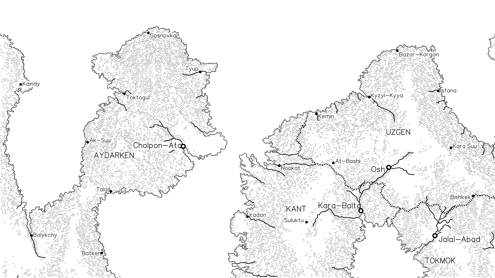

# FantasyMapGenerator

This is a Docker packaged version of https://github.com/rlguy/FantasyMapGenerator which implements https://github.com/mewo2/terrain.

```
$ docker run -it -v $(pwd):/output gregbuehler/fantasymapgenerator -h
Usage: map_generation [-hv] [-s <uint>] [--timeseed] [-r <float>] [-o filename] [<file>] [-e <float>] [--erosion-steps=<int>] [-c <int>] [-t <int>] [--size=<widthpx:heightpx>] [--draw-scale=<float>] [--no-slopes] [--no-rivers] [--no-contour] [--no-borders] [--no-cities] [--no-towns] [--no-labels] [--no-arealabels] [--drawing-supported]

Options:

  -h, --help                     display this help and exit
  -s, --seed=<uint>              set random generator seed
  --timeseed                     set seed from system time
  -r, --resolution=<float>       level of map detail
  -o, --output=filename          output file
  <file>                         output file
  -e, --erosion-amount=<float>   erosion amount
  --erosion-steps=<int>          number of erosion iterations
  -c, --cities=<int>             number of generated cities
  -t, --towns=<int>              number of generated towns
  --size=<widthpx:heightpx>      set output image size
  --draw-scale=<float>           set scale of drawn lines/points
  --no-slopes                    disable slope drawing
  --no-rivers                    disable river drawing
  --no-contour                   disable contour drawing
  --no-borders                   disable border drawing
  --no-cities                    disable city drawing
  --no-towns                     disable town drawing
  --no-labels                    disable label drawing
  --no-arealabels                disable area label drawing
  --drawing-supported            display whether drawing is supported and exit
  -v, --verbose                  output additional information to stdout
$ docker run -it -v $(pwd):/output gregbuehler/fantasymapgenerator -o /output/example.png
```

